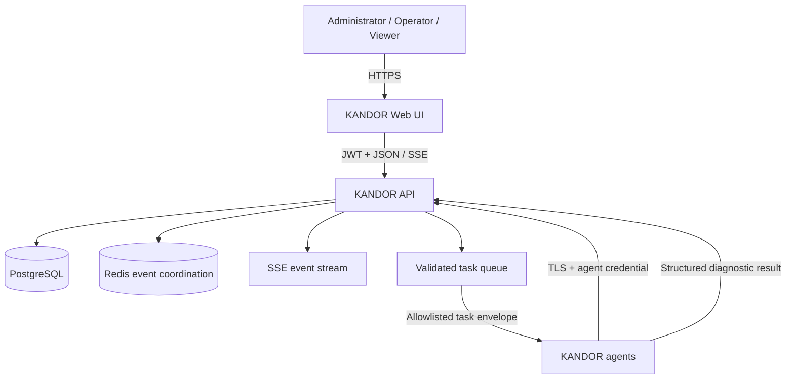

# KANDOR

**KANDOR — Self-Hosted Security Agent Orchestration Platform**

KANDOR is a defensive-security lab platform for managing transparent, least-privilege diagnostic agents from a modern web console. It demonstrates authenticated agent enrollment, health telemetry, asynchronous allowlisted tasking, structured results, live events, RBAC, and immutable audit history without providing remote-shell or arbitrary-code-execution capabilities.

> KANDOR is intended for education, controlled lab use, and defensive engineering portfolios. Only deploy agents on systems you own or are explicitly authorized to monitor.

## What is included

- A FastAPI management plane with PostgreSQL persistence, Redis-backed coordination, OpenAPI documentation, request validation, health checks, and structured JSON logs.
- A React and TypeScript SOC-style console with dashboards, searchable records, role-aware actions, and live Server-Sent Events (SSE).
- A lightweight Python agent whose dispatcher maps a closed task enum to dedicated local diagnostic functions.
- Argon2 password hashing, short-lived JWT access tokens, rotating/revocable refresh sessions, RBAC, agent credential hashing, and expiring one-time enrollment tokens.
- Agent heartbeat classification (`ONLINE`, `DEGRADED`, `OFFLINE`), task lifecycle tracking, safe structured results, and an append-only audit trail.
- Docker Compose deployment, a scaled demo-agent profile, migrations, tests, lint/type checks, and pull-request CI.

## Safety boundary

KANDOR is deliberately **not** a remote administration tool. Operators choose a task type from this closed set:

`SYSTEM_INFO`, `HOSTNAME`, `CURRENT_USER`, `CPU_INFO`, `MEMORY_USAGE`, `DISK_USAGE`, `NETWORK_INTERFACES`, `UPTIME`, `PROCESS_INVENTORY`, `INSTALLED_SOFTWARE`, `LISTENING_PORTS`, `AGENT_HEALTH`, and `PING`.

The API validates this enum, the agent validates it again, and every type is implemented by a specific Python handler. Task payloads cannot contain commands or executable paths. Unknown values are rejected before dispatch. The agent does not install persistence, hide itself, bypass security controls, or disable TLS verification in production.

## Architecture



The management plane never sends a command line. A task is a typed record whose state advances through `QUEUED`, `DISPATCHED`, `RUNNING`, and a terminal state (`SUCCESS`, `FAILED`, `CANCELLED`, or `EXPIRED`). See [Architecture](docs/ARCHITECTURE.md) for trust boundaries and sequence diagrams.

## Quick start with Docker

Requirements: Docker Engine/Desktop with Compose v2, at least 2 GB of free memory, and ports 3000 and 8000 available.

```bash
git clone <your-kandor-repository-url> kandor
cd kandor
cp .env.example .env
# Edit .env: replace every CHANGE_ME value before using anything except a local lab.
docker compose up --build
```

For generated independent local secrets instead of editing placeholders manually, run `python scripts/generate_env.py` in place of the copy step.

Open:

- Web console: <http://localhost:3000>
- API documentation: <http://localhost:8000/docs>
- API readiness: <http://localhost:8000/health/ready>

For the sample `.env`, the development users are `admin@example.local`, `operator@example.local`, and `viewer@example.local`; their passwords are the corresponding environment values. KANDOR never embeds those passwords in application code or a database migration.

Stop the stack with `docker compose down`. To also discard local database and agent volumes, run `make reset-db`; this is intentionally a separate destructive command.

## Demo lab

Start the core services plus five isolated diagnostic agents:

```bash
docker compose --profile demo up --build --scale kandor-agent=5
```

Each replica gets its own container filesystem and UUID, sends heartbeats, and only inventories its own container. Demo auto-enrollment requires `KANDOR_ENVIRONMENT=development` and `KANDOR_DEMO_BOOTSTRAP_SECRET`; the endpoint is disabled in every other environment. Normal deployments use one-time enrollment tokens.

## Enroll a real agent

1. Sign in as an administrator and create an enrollment token in **Settings → Enrollment tokens**, or run `kandor create-enrollment-token` in the backend container.
2. Install the agent on an authorized host.
3. Enroll once and then run it:

```bash
python -m pip install ./agent
kandor-agent enroll --server https://kandor.example.local --token '<one-time-token>'
kandor-agent run
```

The token is short-lived and single-use. The returned agent credential is stored locally with restrictive permissions where the operating system supports them. Production agents verify server certificates; use a trusted internal CA or publicly trusted certificate, never an insecure verification flag.

## Local development

Python 3.12+, Node.js 22.12+, PostgreSQL 16+, and Redis 7+ are recommended.

```bash
make install
cp .env.example .env
make backend       # API with reload
make frontend      # Vite development server
make test
```

Useful commands:

| Command | Purpose |
|---|---|
| `make install` | Install backend, agent, and frontend development dependencies |
| `make dev` | Start the full Compose development stack |
| `make backend` | Run the API locally |
| `make frontend` | Run the Vite frontend |
| `make test` | Run backend, agent, and frontend tests |
| `make lint` | Run Python and TypeScript linters |
| `make format` | Apply supported formatters |
| `make build` | Compile Python sources, build the frontend, and validate Compose |
| `make up` / `make down` | Manage the Compose stack |
| `make logs` | Follow Compose service logs |
| `make reset-db` | Delete Compose volumes after an explicit confirmation variable |

VS Code recommendations live in `.vscode/`. The API defaults to <http://localhost:8000>, while Vite proxies `/api` and `/health` during development.

## Administration CLI

The backend package exposes `kandor` commands backed by the same services as the API:

```bash
kandor status
kandor create-user
kandor create-enrollment-token
kandor list-agents
kandor list-tasks
```

Run `kandor --help` for command flags. User passwords are collected through protected prompts when omitted; avoid passing secrets as command-line arguments because shell history may retain them.

## API overview

All application routes are below `/api/v1/`:

- `/auth` — login, refresh rotation, logout, and current session.
- `/users` — administrator-only account and role management.
- `/agents` — inventory, details, heartbeats, and authenticated agent polling.
- `/enrollment` — administrative token lifecycle and agent enrollment.
- `/tasks` — validated creation, lifecycle transitions, structured results, and cancellation.
- `/audit` — filtered, paginated audit events.
- `/dashboard` — aggregate health/task/version/OS/activity metrics.
- `/events` — authenticated SSE updates.
- `/settings` — persisted operational thresholds.

Interactive OpenAPI docs are served at `/docs` in development and test deployments; production disables the CDN-backed HTML UI while retaining `/openapi.json`. Agent credentials and user JWTs are separate authentication domains and are not interchangeable. See [API and agent protocol](docs/API.md).

## Testing and validation

```bash
make test
make lint
make build
docker compose config --quiet
docker compose build
python scripts/smoke_test.py
```

The suites cover authentication failures and refresh rotation, RBAC denials, enrollment expiry/reuse/revocation, heartbeat status transitions, allowlist enforcement, task lifecycle/results, audit events, agent reconnect behavior, frontend protected routes and core views, type checking, and production builds. The smoke script exercises those contracts against a running stack without printing credentials. CI runs component checks and container builds on every pull request.

## Security model and limitations

- KANDOR assumes the server, database, and Redis instance are in a trusted management network. Terminate TLS at a hardened reverse proxy or load balancer and use network policy/firewall rules in production.
- JWT signing secrets, database passwords, seed passwords, demo secrets, and TLS private keys belong in a secret manager or protected environment—not Git.
- The browser keeps the access token in memory and uses rotation for refresh sessions; deployments should prefer secure, `HttpOnly`, `SameSite` cookies where cross-origin architecture permits.
- Diagnostic inventory can itself be sensitive. Apply least privilege, minimize retention, and restrict viewer/operator membership.
- The append-only application audit policy protects against normal API mutation. Database superusers can still alter data; forward logs to write-once external storage for stronger non-repudiation.
- Container demo agents observe their containers, not their host. KANDOR is not an EDR, SIEM, vulnerability scanner, exploitation framework, or remote shell.

Read [Security policy](SECURITY.md), [Threat model](docs/THREAT_MODEL.md), and [Deployment guide](docs/DEPLOYMENT.md) before operating outside a workstation lab.

## Project status

KANDOR `0.1.0` is an educational reference implementation. Review the [changelog](CHANGELOG.md) and open issues for release-specific notes. Contributions are welcome under the [contribution guide](CONTRIBUTING.md).

## Screenshots

Screenshots are intentionally generated from the running application so they reflect the checked-out version. Add captures to `docs/screenshots/` after starting the demo profile:

- Dashboard overview
- Agent detail and heartbeat history
- Allowlisted task result
- Audit event search

## License and name

Released under the MIT License. KANDOR uses an original visual identity and does not include or claim affiliation with copyrighted Superman artwork, logos, fonts, or other franchise assets.
