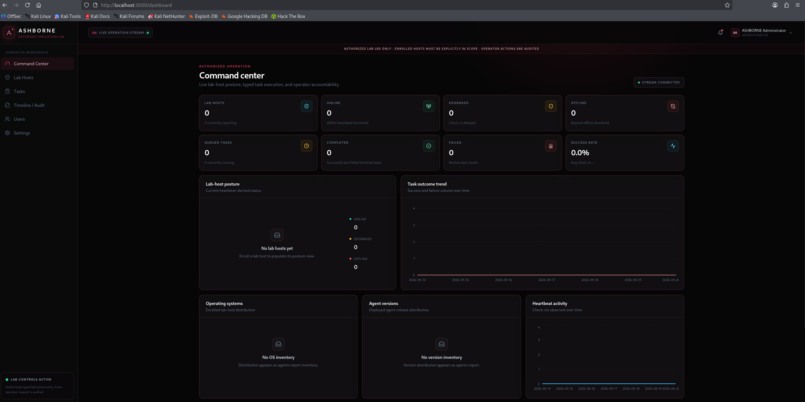
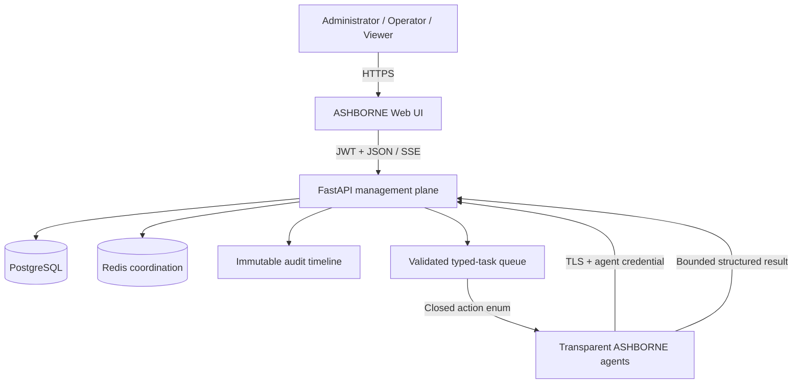

<p align="center">
  
</p>

# ASHBORNE

**Adversary Emulation & Offensive Security Lab Platform**

ASHBORNE is a self-hosted operator console for authorized adversary-emulation,
red-team lab, and pentesting training workflows. It combines authenticated agent
enrollment, strongly typed local-host actions, shared task state, live events,
RBAC, and an immutable audit trail without exposing a general remote shell.

> **Authorized lab use only.** Deploy agents only on systems you own or are
> explicitly authorized to test. Every operator task requires an in-scope
> confirmation and is written to the audit timeline.

## Preview

<!-- Replace this placeholder with an ASHBORNE dashboard/banner image -->



## Overview

ASHBORNE retains the proven management-plane architecture and changes the
operator experience from endpoint monitoring to bounded offensive-security
training. The platform is designed around five principles:

- **Explicit scope:** task creation requires confirmation that the enrolled host
  is part of an authorized lab.
- **Typed execution:** the API and agent independently validate a closed action
  enum and per-action parameter schema.
- **Transparent agents:** no covert transport, masquerading, persistence, or
  security-control bypass is implemented.
- **Shared operations:** operators see the same lab hosts, task lifecycle,
  structured results, Server-Sent Events (SSE), and timeline.
- **Accountability:** role-aware actions and immutable audit events retain the
  actor, target host, task type, source address, and scope confirmation.

The operator catalog is organized as follows:

| Area | Included typed actions |
|---|---|
| Recon | Quick Recon, System Info, Hostname, Current User, Uptime |
| Host Enumeration | CPU, memory, disks, processes, installed software |
| Privilege Enumeration | Security Context |
| Files | File System Overview with fixed-location metadata only |
| Network | Interfaces, connections, route table, listening ports |
| Agent Control | Agent Health and authenticated Ping |

`QUICK_RECON` is a one-click passive baseline. It gathers bounded local system,
security-context, interface, listener, route, uptime, and fixed-location metadata.
It performs no active network probing, DNS resolution, file-content collection,
payload execution, or arbitrary command dispatch.

## Architecture



The existing authentication, RBAC, one-time enrollment, task lifecycle,
PostgreSQL, Redis, SSE, audit, React/TypeScript, and test architecture are retained.
A task advances through `QUEUED`, `DISPATCHED`, `RUNNING`, and one terminal state:
`SUCCESS`, `FAILED`, `CANCELLED`, or `EXPIRED`.

The Compose topology uses three networks:

| Network | Purpose | Internal |
|---|---|---|
| `ashborne-data` | Backend to PostgreSQL/Redis | Yes |
| `ashborne-agent` | Demo agents to backend | Yes |
| `ashborne-proxy` | Frontend/backend and host-published ports | **No** |

Keeping `ashborne-proxy` host-facing is intentional: setting it to
`internal: true` prevents the published UI and API ports from working on the host.

See [Architecture](docs/ARCHITECTURE.md), [API](docs/API.md), and the
[Threat model](docs/THREAT_MODEL.md) for the detailed trust boundaries.

## Quick start

Requirements: Docker Engine/Desktop with Compose v2, Python 3.12+ for helper
scripts, at least 2 GB free memory, and host ports 3000 and 8000 available.

```bash
git clone <your-ashborne-repository-url> ashborne
cd ashborne
python scripts/generate_env.py
docker compose up --build -d
docker compose ps
```

Verify both published host mappings and backend readiness:

```bash
curl --fail http://127.0.0.1:3000/
curl --fail http://127.0.0.1:8000/health/live
curl --fail http://127.0.0.1:8000/health/ready
python scripts/smoke_test.py
```

Open:

- Operator console: <http://localhost:3000>
- API documentation: <http://localhost:8000/docs>
- Readiness check: <http://localhost:8000/health/ready>

Development identities are `admin@example.local`, `operator@example.local`, and
`viewer@example.local`. Their generated passwords are stored in the untracked
`.env` file under the matching `ASHBORNE_*_PASSWORD` variables.

Stop the stack with `docker compose down`. To discard local database and agent
volumes, use the separately guarded `make reset-db CONFIRM=reset-ashborne` command.

## Demo lab

Start the core stack and five isolated lab agents:

```bash
docker compose --profile demo up --build -d --scale ashborne-agent=5
docker compose ps
python scripts/smoke_test.py
```

Each replica receives its own anonymous state volume and identity, checks in over
the internal agent network, and can inspect only its own container. Demo automatic
enrollment requires `ASHBORNE_ENVIRONMENT=development` plus the generated
`ASHBORNE_DEMO_BOOTSTRAP_SECRET`; the endpoint is disabled in other environments.

Suggested training flow:

1. Sign in as an operator.
2. Open **Lab Hosts** and select an online demo host.
3. Open **Tasks**, choose **Quick Recon**, review the authorization confirmation,
   and queue the action.
4. Watch the task move through its lifecycle and inspect the structured result.
5. Open **Timeline / Audit** and locate the matching `TASK_CREATED`, dispatch,
   start, and completion events.

## Agent workflow

For a non-demo host, an administrator creates a short-lived, single-use enrollment
token in **Settings → Enrollment tokens** or with the backend CLI. Install and
enroll the agent only on an authorized lab system:

```bash
python -m pip install ./agent
ashborne-agent enroll --server https://ashborne.example.local --token '<one-time-token>'
ashborne-agent run
```

The returned machine credential is stored locally with restrictive permissions
where supported. Production agents require valid TLS verification. The agent
polls for typed tasks, validates each task again, executes a dedicated Python/
`psutil` handler, caps the result size, and durably retries failed result delivery.

The backend administration CLI is installed as `ashborne`:

```bash
ashborne status
ashborne create-user
ashborne create-enrollment-token
ashborne list-agents
ashborne list-tasks
```

## Development setup

Recommended versions are Python 3.12+, Node.js 22.12+, PostgreSQL 16+, and Redis
7+. For the standard local workflow:

```bash
make install
python scripts/generate_env.py
make test
make lint
make build
```

Run components independently with `make backend` and `make frontend`, or use
`make dev` for Compose. The backend container applies `alembic upgrade head`
before startup. A new ASHBORNE deployment uses the included initial schema; there
is no cross-project database migration because this is a separate project and data store.

Useful direct checks:

```bash
python scripts/check_allowlist_sync.py
python scripts/check_compose_isolation.py
cd backend && python -m pytest
cd ../agent && python -m pytest
cd ../frontend && npm test -- --run && npm run build
docker compose --profile demo config --quiet
```

## Security model

- Management users authenticate separately from enrolled agents. Access tokens
  are short-lived; refresh tokens rotate and can be revoked.
- RBAC separates administrators, operators, and read-only viewers.
- Enrollment tokens expire, are single-use, and are stored only as hashes.
- Task types and parameters are validated by both the API and the agent.
- Operators must confirm authorized scope for each task; the confirmation is
  included in `TASK_CREATED` audit metadata.
- The agent contains no subprocess or shell execution surface and accepts no
  command text or executable paths.
- Results are structured JSON with collection and size bounds.
- Data/agent networks remain isolated while the proxy network permits intentional
  loopback host publishing.
- Production deployments should terminate TLS at a hardened ingress, keep secrets
  in a secret manager, forward audit events to protected storage, and restrict
  management access by network policy.

ASHBORNE borrows only high-level workflow ideas from established operator tools:
shared sessions/task state and event history are documented by
[Cobalt Strike's team operations guide](https://hstechdocs.helpsystems.com/manuals/cobaltstrike/current/userguide/content/topics/welcome_distributed-and-team-ops.htm),
while Realm publicly emphasizes multi-host management, reliability, automation,
and a web operator interface in its
[project overview](https://github.com/spellshift/realm). ASHBORNE intentionally
does **not** reproduce payload, covert-channel, loader, credential-access,
persistence, evasion, lateral-movement, or unrestricted scripting features.

Read [SECURITY.md](SECURITY.md), [Deployment](docs/DEPLOYMENT.md), and the
[Threat model](docs/THREAT_MODEL.md) before using ASHBORNE outside a disposable
workstation lab.

## Limitations

- ASHBORNE is an educational adversary-emulation lab, not a covert C2 framework,
  exploit framework, vulnerability scanner, EDR, or SIEM.
- Current network actions are passive local observations. Active port scanning,
  remote exploitation, credential collection, phishing, payload generation,
  pivoting, and lateral movement are intentionally absent.
- File workflows report metadata for fixed local locations and never return file
  contents or accept arbitrary paths.
- The route-table handler currently reads Linux `/proc` data; unsupported systems
  return an explicit `supported: false` result.
- Container demo agents observe their containers, not the Docker host.
- Application-level append-only controls cannot stop a PostgreSQL superuser from
  altering records; forward audit data externally for stronger non-repudiation.
- A real Docker runtime is required for container, published-port, and healthcheck
  verification; static Compose validation alone is not equivalent.

## Screenshots

Place version-matched captures in `docs/screenshots/`:

- `ashborne-preview.png` — command-center banner or dashboard
- `lab-hosts.png` — scoped host inventory
- `quick-recon.png` — typed action and structured result
- `timeline-audit.png` — operation timeline

The directory contains its own README so it remains tracked before final captures
are added.

## License

Released under the [MIT License](LICENSE).

ASHBORNE is an independent project. Cobalt Strike and Realm are referenced only
for comparative product research; their names and trademarks belong to their
respective owners.
