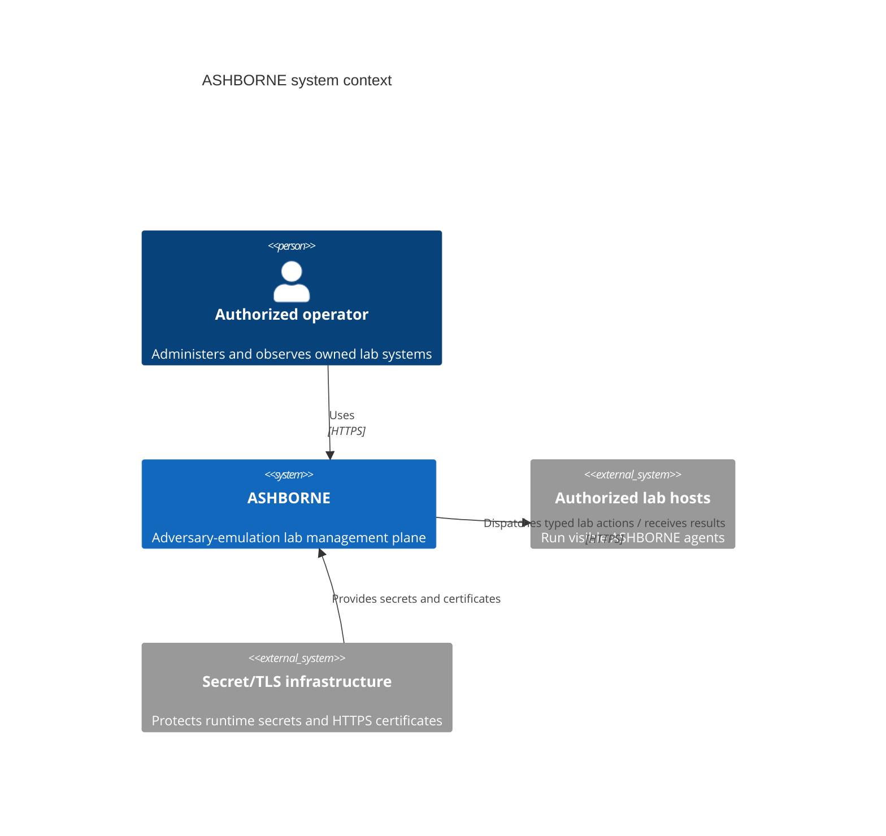
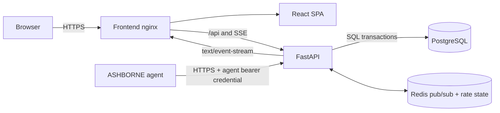
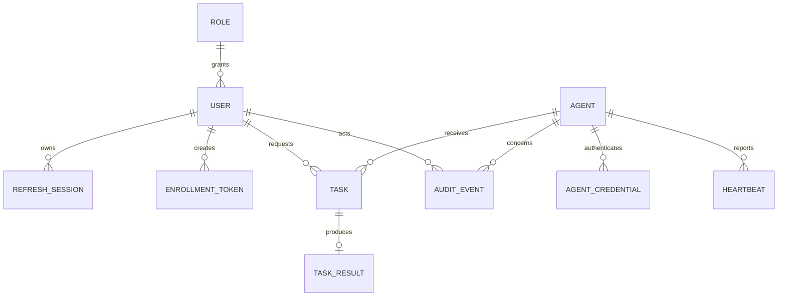

# ASHBORNE architecture

## System context

ASHBORNE separates interactive user authentication, machine authentication, task orchestration, and typed lab-action execution. The API is the sole writer to PostgreSQL and the only component that authorizes state transitions. Redis distributes ephemeral live events; PostgreSQL remains the source of truth.



## Containers and data flow



The frontend nginx container is a same-origin gateway in the local deployment. In a production deployment, place the stack behind an HTTPS reverse proxy and expose neither PostgreSQL nor Redis.

## Trust boundaries

1. **Browser → management plane:** untrusted JSON is schema-validated, access tokens are scoped by role, refresh sessions rotate, and security headers constrain browser behavior.
2. **Agent → management plane:** agent bearer credentials are high-entropy and stored hashed server-side. The referenced agent ID must match the authenticated credential.
3. **Management plane → agent:** a task contains an enum and bounded typed parameters, never command text. The agent independently validates the enum and chooses a compiled-in handler.
4. **API → storage:** SQLAlchemy parameterization prevents query interpolation. Audit mutations are only inserts through the application surface.
5. **Development demo:** its shared bootstrap secret is accepted only when development mode is explicit. It is not a production enrollment mechanism.

## Agent enrollment sequence

```mermaid
sequenceDiagram
    actor Admin
    participant UI as ASHBORNE UI
    participant API as ASHBORNE API
    participant DB as PostgreSQL
    participant Agent as ashborne-agent

    Admin->>UI: Request enrollment token
    UI->>API: POST /api/v1/enrollment/tokens (admin JWT)
    API->>DB: Store hash, expiry, creator, unused state
    API-->>UI: Return plaintext token once
    Admin-->>Agent: Transfer token over authorized channel
    Agent->>API: POST /api/v1/enrollment
    API->>DB: Lock and validate token; create agent + credential hash; consume token; audit
    API-->>Agent: Agent UUID + credential (returned once)
    Agent->>Agent: Persist UUID/credential with restrictive permissions
```

Replays encounter a consumed token and fail. Revocation and expiration are checked inside the same enrollment transaction used to consume the token.

## Heartbeat sequence

```mermaid
sequenceDiagram
    participant Agent as ashborne-agent
    participant API as ASHBORNE API
    participant DB as PostgreSQL
    participant Events as Redis/SSE
    participant UI as ASHBORNE UI

    loop Configured interval with jitter
        Agent->>API: POST /api/v1/agents/{id}/heartbeat (agent credential)
        API->>API: Authenticate credential and validate ownership/payload
        API->>DB: Insert bounded heartbeat; update last-seen snapshot
        API->>DB: Append AGENT_HEARTBEAT audit event
        API->>Events: Publish heartbeat/health event
        Events-->>UI: SSE update
        API-->>Agent: Server time and accepted state
    end
```

Status is derived from `now - last_seen`: online at or below the online threshold, degraded until the offline threshold, and offline beyond it. Enrollment records server receipt time, so a new agent starts online and naturally ages to degraded/offline if it never sends a heartbeat.

## Task execution sequence

```mermaid
sequenceDiagram
    actor Operator
    participant UI as ASHBORNE UI
    participant API as ASHBORNE API
    participant DB as PostgreSQL
    participant Agent as ashborne-agent

    Operator->>UI: Choose in-scope host + typed lab action; confirm authorization
    UI->>API: POST /api/v1/tasks (operator JWT + scope confirmation)
    API->>API: Enforce role, confirmation, enum, typed parameter schema
    API->>DB: Insert QUEUED task + TASK_CREATED audit
    Agent->>API: GET /api/v1/agents/{id}/tasks
    API->>DB: Atomically claim task as DISPATCHED
    API-->>Agent: Typed task envelope
    Agent->>Agent: Revalidate enum and parameters
    Agent->>API: POST /api/v1/tasks/{id}/start
    API->>DB: Transition DISPATCHED → RUNNING + audit
    Agent->>Agent: Run dedicated bounded Python handler
    Agent->>API: POST /api/v1/tasks/{id}/result (structured JSON)
    API->>DB: Transition RUNNING → SUCCESS/FAILED; store result; audit
    API-->>UI: SSE lifecycle update
```

Invalid transitions, wrong-agent submissions, expired work, duplicate completion, command-like fields, and unknown task types are rejected.

Bulk operations are a management-plane grouping, not a new execution primitive.
The API assigns a `bulk_operation_id`, then creates one normal task row per
selected agent. Dispatch, ownership checks, transitions, structured results,
errors, and audit records continue to operate on those independent task IDs.
Failed-only retry and full rerun create a new grouping so historical operations
remain immutable and understandable.

## Data model



Frequently filtered columns—normalized email, agent status/last seen, task status/creation time, token hash/expiry, audit type/timestamp, and foreign keys—are indexed. UUIDs provide non-sequential public identifiers. Timestamps are stored in UTC.

## Availability and consistency

- PostgreSQL transactions serialize one-time token consumption and task claims. A bounded dispatch lease permits safe task redelivery when an HTTP response is lost before the agent acknowledges start.
- A missed Redis event does not lose authoritative state; clients re-fetch snapshots on reconnect.
- Agents use bounded exponential backoff with jitter and do not discard a completed result merely because one submission attempt fails.
- SSE uses keepalives and browser reconnection. Consumers treat events as invalidation hints rather than an event-sourced database.
- Health classification is computed from server-observed receipt time so an untrusted or skewed agent clock cannot keep itself online.
- Audit rows are immutable through ORM/API paths. A narrowly scoped maintenance path deletes records older than the administrator-selected retention window and records an `AUDIT_RETENTION_PURGED` event.

## Source layout

- `backend/app`: API routers, security dependencies, database models/schemas, services, middleware, events, settings, and CLI.
- `backend/alembic`: reviewed schema migrations.
- `backend/tests`: service and API security/lifecycle tests.
- `frontend/src`: pages, reusable UI, typed API client, auth/event hooks, and tests.
- `agent/ashborne_agent`: configuration, secure enrollment, transport, heartbeat/poll loop, and handlers.
- `docs`: architecture, protocol, deployment, operations, and threat model.
